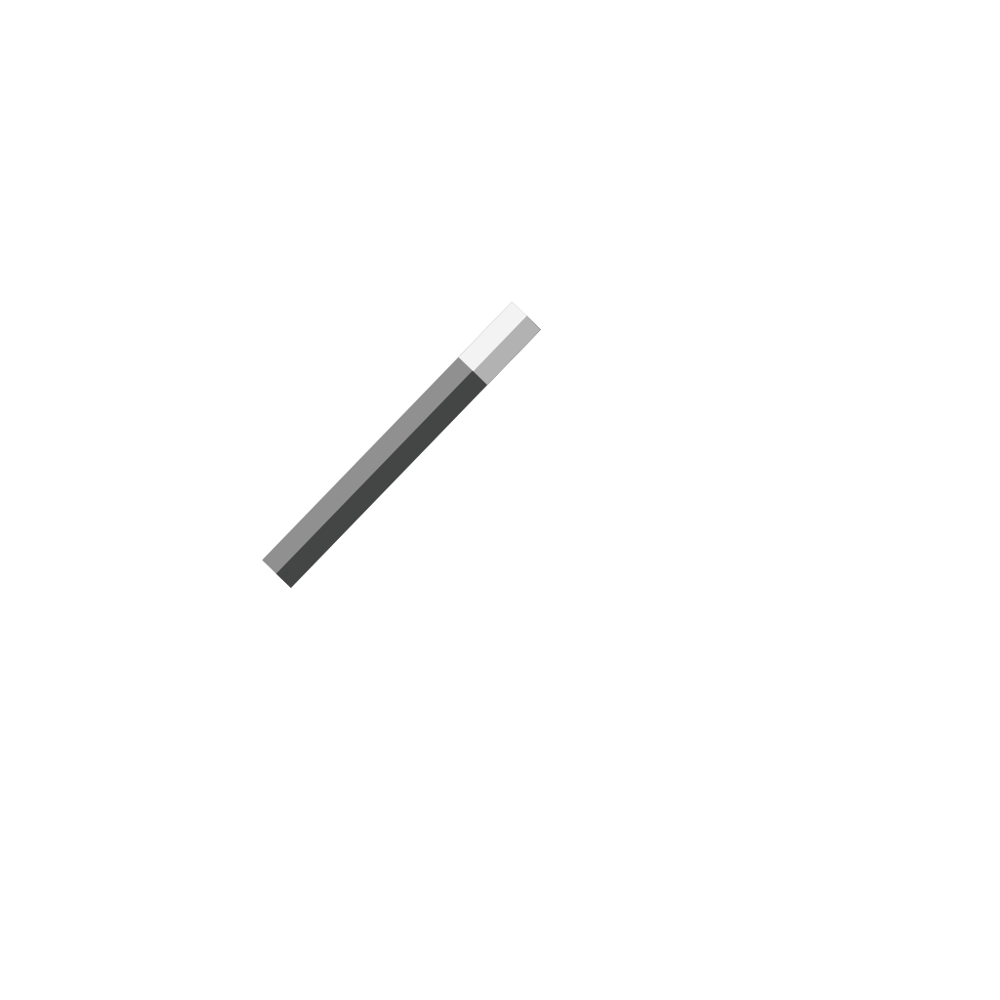

# Lumos CLI Framework


<p align="center">
    
</p>

**Lumos** (Latin for "light") is a modern, enterprise-grade CLI framework for Lua, inspired by Cobra for Go. It provides a comprehensive toolkit for building sophisticated command-line applications with advanced features like typed flags, configuration management, command aliases, and robust validation.
## 🌟 Key Features

Lumos CLI Framework offers a comprehensive set of enterprise-ready features:

### 🚀 **Core Features**
- **POSIX-compliant argument parsing**: Supports both short (`-h`) and long (`--help`) flags
- **Fluent API**: Chainable methods for defining commands, arguments, flags, and actions
- **Automatic help generation**: Built-in help text with usage examples
- **Subcommand support**: Nested commands for complex CLI structures

### 🎯 **Advanced Flag System** (NEW in v0.3.0)
- **Typed flags**: `flag_int()`, `flag_email()`, `flag_string()` with automatic validation
- **Flag validation**: Min/max constraints, required flags, format validation
- **Persistent flags**: Flags inherited by subcommands
- **Command aliases**: Multiple names for the same command (`add`, `a`, `create`)

### ⚙️ **Configuration Management** (NEW in v0.3.0)
- **External configuration**: Load from JSON files and environment variables
- **Priority hierarchy**: Flags > Environment > Config file > Defaults
- **Built-in JSON codec**: Complete encode/decode support

### 🎨 **Rich UI Components**
- **Color and styling**: ANSI colors with terminal detection and contextual helpers
- **Progress bars**: Simple and advanced progress indicators with ETA
- **Interactive prompts**: Input, password, confirmations, selections with validation
- **Loading animations**: Spinners with customizable styles
- **Boxed tables**: Formatted output with headers and alignment

### 🛡️ **Robust Validation**
- **Input validators**: Email, URL, number, path validation
- **Error handling**: Clear error messages and graceful failure
- **Type safety**: Automatic type conversion and validation

## 📦 Installation


### Requirements
- Lua 5.1+ or LuaJIT
- LuaRocks package manager (recommended)
- Unix-like system (Linux, macOS) or Windows

### Install from LuaRocks

```bash
# Install Lumos from LuaRocks
luarocks install lumos
```

### Usage in Your Projects

To use Lumos, simply require the necessary modules in your Lua script:

```lua
local lumos = require('lumos')
local color = require('lumos.color')
local progress = require('lumos.progress')
local prompt = require('lumos.prompt')
local tbl = require('lumos.table')
local loader = require('lumos.loader')
```

### Development Installation

To contribute to Lumos or use the latest version:

```bash
# Clone the repository and install
git clone https://github.com/benoitpetit/lumos.git
cd lumos
luarocks make lumos-0.3.0-1.rockspec
```

### Manual Installation (without LuaRocks)

If you can't use LuaRocks:

```bash
git clone https://github.com/benoitpetit/lumos.git
cd lumos

# Add to your Lua scripts:
# package.path = package.path .. ";/path/to/lumos/?.lua;/path/to/lumos/?/init.lua"
```


## 📚 Complete API Reference

### Application (`lumos.new_app`)

#### Creating an Application
```lua
local app = lumos.new_app({
    name = "myapp",           -- Application name (required)
    version = "1.0.0",        -- Version string (optional)
    description = "My app"    -- Description (optional)
})
```

#### Application Methods
- `app:command(name, description)` - Create a new command
- `app:flag(spec, description)` - Add a global flag
- `app:run(args)` - Parse arguments and execute commands

### Commands

#### Creating Commands
```lua
local cmd = app:command("commandname", "Command description")
```

#### Command Methods
- `cmd:arg(name, description)` - Add positional argument
- `cmd:flag(spec, description)` - Add boolean flag
- `cmd:option(spec, description)` - Add flag with value
- `cmd:subcommand(name, description)` - Add a subcommand (NEW)
- `cmd:action(function)` - Set command action

#### Flag Specifications
```lua
-- Boolean flags
cmd:flag("-v --verbose", "Enable verbose output")
cmd:flag("--debug", "Enable debug mode")
cmd:flag("-q", "Quiet mode")

-- Options (flags with values)
cmd:option("-o --output", "Output file")
cmd:option("--format", "Output format")
```

#### Action Context
The action function receives a context object:
```lua
cmd:action(function(ctx)
    -- ctx.args - Array of positional arguments
    -- ctx.flags - Table of flag values
    -- ctx.command - Reference to command object
    
    local name = ctx.args[1]
    if ctx.flags.verbose then
        print("Verbose mode enabled")
    end
    
    return true -- Return true for success, false for error
end)
```

### Colors and Styling (`lumos.color`)

#### Basic Colors
```lua
local color = require('lumos.color')

print(color.red("Red text"))
print(color.green("Green text"))
print(color.blue("Blue text"))
print(color.yellow("Yellow text"))
print(color.magenta("Magenta text"))
print(color.cyan("Cyan text"))
print(color.bold("Bold text"))
print(color.dim("Dim text"))
```

#### Template Formatting
```lua
print(color.format("{red}Error:{reset} Something went wrong"))
print(color.format("{green}{bold}Success!{reset} Operation completed"))
print(color.format("{blue}Info:{reset} {dim}Additional details{reset}"))
```

#### Available Colors
- Basic: `red`, `green`, `blue`, `yellow`, `magenta`, `cyan`, `black`, `white`
- Bright: `bright_red`, `bright_green`, etc.
- Background: `bg_red`, `bg_green`, etc.
- Styles: `bold`, `dim`, `italic`, `underline`, `strikethrough`
- Special: `reset` (clears all formatting)

#### Color Control
```lua
color.enable()          -- Force enable colors
color.disable()         -- Force disable colors
color.is_enabled()      -- Check if colors are enabled
```

### Progress Bars (`lumos.progress`)

#### Simple Progress
```lua
local progress = require('lumos.progress')

for i = 1, 100 do
    progress.simple(i, 100)
    -- Do work here
end
```

#### Advanced Progress Bar
```lua
local bar = progress.new({
    total = 100,
    width = 50,
    format = "[{bar}] {percentage}% ({current}/{total}){eta}",
    fill = "█",
    empty = "░",
    prefix = "Processing: ",
    suffix = " Complete"
})

for i = 1, 100 do
    bar:update(i)  -- or bar:increment()
    -- Do work here
end
```

### Interactive Prompts (`lumos.prompt`)

#### Text Input
```lua
local prompt = require('lumos.prompt')

local name = prompt.input("What's your name?", "Anonymous")
local email = prompt.input("Email address:")
```

#### Password Input
```lua
local password = prompt.password("Enter password")
```

#### Confirmation
```lua
local confirm = prompt.confirm("Are you sure?", false)
local proceed = prompt.confirm("Continue?", true) -- Default to yes
```

#### Selection
```lua
local options = {"Option 1", "Option 2", "Option 3"}
local choice, value = prompt.select("Choose an option:", options, 1)
print("You chose: " .. value)
```

#### Validation
```lua
local valid, result = prompt.validate(input, function(val)
    return #val > 3
end, "Input must be longer than 3 characters")
```

### Boxed Tables (`lumos.table`)

#### Creating Boxed Tables
```lua
local tbl = require('lumos.table')

-- Simple boxed table
local items = {"Item 1", "Item 2", "Item 3"}
print(tbl.boxed(items))

-- With header and footer
print(tbl.boxed(items, {
    header = "My Items",
    footer = "End of List",
    align = "center"
}))
```

#### Table Options
- `header` - Add a header row
- `footer` - Add a footer row
- `align` - Text alignment: "left", "center", "right"
- `large` - Adapt width to terminal size

### Loading Animations (`lumos.loader`)

#### Basic Loader
```lua
local loader = require('lumos.loader')

-- Start a loader
loader.start("Processing files")

-- Animate the loader (call in a loop)
loader.next()

-- Stop with different statuses
loader.success()  -- Shows [OK]
loader.fail()     -- Shows [FAIL]
loader.stop()     -- Shows [STOP]
```

#### Loader Styles
```lua
-- Different animation styles
loader.start("Loading", "standard")  -- |, /, -, \
loader.start("Loading", "dots")      -- .  , .. , ...
loader.start("Loading", "bounce")    -- ◜, ◠, ◝, ◞, ◡, ◟
```

## 🆕 New Features in v0.3.0

### 🎯 Typed Flags with Validation

Define flags with specific types and automatic validation:

```lua
local cmd = app:command("create", "Create a resource")

-- Integer flags with min/max constraints
cmd:flag_int("--port", "Port number", 1, 65535)
cmd:flag_int("--timeout", "Timeout in seconds", 1, 3600)

-- Email validation
cmd:flag_email("--email", "Contact email address")

-- String flags (equivalent to :option())
cmd:flag_string("--name", "Resource name")
```

**Supported Types:**
- `flag_int(spec, desc, min, max)` - Integer with range validation
- `flag_email(spec, desc)` - Email format validation  
- `flag_string(spec, desc)` - String value (same as option)
- `flag(spec, desc)` - Boolean flag

### 🔗 Command Aliases

Create multiple names for the same command:

```lua
local add = app:command("add", "Add an item")
add:alias("a")        -- Short alias: 'a'
add:alias("create")   -- Alternative: 'create'
add:alias("new")      -- Another option: 'new'

-- All of these work:
-- myapp add item
-- myapp a item  
-- myapp create item
-- myapp new item
```

### 🔄 Persistent Flags

Define flags that are inherited by all subcommands:

```lua
-- App-level persistent flags
app:persistent_flag("-v --verbose", "Enable verbose output")
app:persistent_flag("--dry-run", "Show what would be done")

-- Command-level persistent flags
local deploy = app:command("deploy", "Deploy application")
deploy:persistent_flag("--env", "Deployment environment")

-- All subcommands inherit these flags automatically
```

### ⚙️ Configuration Management

Load configuration from multiple sources with automatic merging:

```lua
local config = require('lumos.config')

-- Load from JSON file
local file_config, err = config.load_file("config.json")

-- Load from environment variables
local env_config = config.load_env("MYAPP") -- Reads MYAPP_* vars

-- Merge with priority: flags > env > config > defaults
local final_config = config.merge_configs(
    {timeout = 30},  -- defaults
    file_config,     -- from config.json
    env_config,      -- from MYAPP_* env vars
    ctx.flags        -- from command line (highest priority)
)
```

**Example config.json:**
```json
{
    "timeout": 60,
    "environment": "production",
    "debug": false
}
```

### 🛡️ Advanced Validation

Robust validation with clear error messages:

```lua
-- Validation happens automatically for typed flags
cmd:flag_int("--port", "Port number", 1, 65535)

-- If user provides: --port 70000
-- Output: Error: Flag --port must be <= 65535

-- If user provides: --port abc  
-- Output: Error: Flag --port must be an integer
```

**Built-in Validators:**
- Email format validation
- URL format validation
- Integer with min/max range
- Number validation
- Path validation
- Required flag validation

### 📋 Enhanced Features (v2.0+)

### Subcommands

Lumos now supports nested subcommands for building complex CLI applications:

```lua
local app = lumos.new_app({name = "myapp"})

-- Create a parent command
local user_cmd = app:command("user", "User management")

-- Add subcommands
local create_user = user_cmd:subcommand("create", "Create a new user")
create_user:arg("username", "Username for the new user")
create_user:flag("-a --admin", "Grant admin privileges")

create_user:action(function(ctx)
    local username = ctx.args[1]
    local is_admin = ctx.flags.admin
    print("Creating user: " .. username .. (is_admin and " (admin)" or ""))
    return true
end)

-- Usage: myapp user create alice --admin
```

### JSON Output

Built-in JSON serialization for structured data output:

```lua
local json = require('lumos.json')

-- Add global JSON flag
app:flag("-j --json", "Output in JSON format")

cmd:action(function(ctx)
    local data = {name = "Alice", age = 30}
    
    if ctx.flags.json then
        print(json.encode(data))
    else
        print("Name: " .. data.name .. ", Age: " .. data.age)
    end
    return true
end)
```

### Enhanced Input Validation

Pre-defined validators for common input types:

```lua
local prompt = require('lumos.prompt')

-- Email validation
local email = prompt.input("Enter your email:")
local valid, error_msg = prompt.validate(email, prompt.validators.email, "Invalid email format")

if not valid then
    print(color.red(error_msg))
end

-- Number validation
local age = prompt.input("Enter your age:")
local valid_age, _ = prompt.validate(age, prompt.validators.number, "Age must be a number")
```

### Enhanced Color Helpers

Contextual color functions for better UX:

```lua
local color = require('lumos.color')

-- Status colors
print(color.status.success("Operation completed!"))
print(color.status.error("Something went wrong"))
print(color.status.warning("Be careful"))
print(color.status.info("Just so you know"))

-- Log-style colors
print(color.log.debug("Debug information"))
print(color.log.info("Information message"))
print(color.log.warn("Warning message"))
print(color.log.error("Error message"))

-- Progress-based coloring
local percentage = 75
local color_name = color.progress_color(percentage) -- Returns "yellow" for 75%
print(color.colorize("Progress: " .. percentage .. "%", color_name))
```

## 🚀 Quick Example

After installing with `luarocks install lumos`:

```lua
#!/usr/bin/env lua

-- No path setup needed with LuaRocks!
local lumos = require('lumos')
local color = require('lumos.color')

-- Create application
local app = lumos.new_app({
    name = "myapp",
    version = "1.0.0",
    description = "My awesome CLI application"
})

-- Add global flags
app:flag("-v --verbose", "Enable verbose output")

-- Define a command
local greet = app:command("greet", "Greet someone")
greet:arg("name", "Name of person to greet")
greet:flag("-u --uppercase", "Use uppercase")
greet:flag("-c --colorful", "Use colors")

greet:action(function(ctx)
    local name = ctx.args[1] or "World"
    local message = "Hello, " .. name .. "!"
    
    if ctx.flags.uppercase then
        message = message:upper()
    end
    
    if ctx.flags.colorful then
        message = color.format("{green}" .. message .. "{reset}")
    end
    
    print(message)
    return true
end)

-- Run the app
app:run(arg)
```


## 🧪 Testing and Examples

### 📚 Example Applications

All examples are located in the `examples/` directory and demonstrate different Lumos features:

#### 🔰 Basic Examples

**Basic Application** (`basic_app.lua`)
```bash
# Show help
lua examples/basic_app.lua --help

# Run commands with different flags
lua examples/basic_app.lua greet Alice
lua examples/basic_app.lua greet Bob --uppercase --colorful
lua examples/basic_app.lua info --all --verbose
```

**UI Components Demos**
```bash
# Color and styling showcase
lua examples/colors_demo.lua

# Progress bars and loaders
lua examples/progress_demo.lua
lua examples/loader_demo.lua
```

#### 🎯 Advanced Examples (v0.3.0)

**Typed Flags with Validation**
```bash
# Demonstrates integer, email, and other typed flags
lua examples/typed_flags.lua create myapp --port 8080 --email admin@example.com
lua examples/typed_flags.lua create webapp --port 70000  # Shows validation error
```

**Command Aliases and Persistent Flags**
```bash
# Multiple ways to call the same command
lua examples/aliases_persistent.lua add book --verbose
lua examples/aliases_persistent.lua a book --count 5 --dry-run
lua examples/aliases_persistent.lua create book --verbose
lua examples/aliases_persistent.lua new book
```

**Configuration Management**
```bash
# Load configuration from file and environment
lua examples/config_example.lua deploy staging --config examples/config.json
lua examples/config_example.lua deploy production --config examples/config.json --dry-run
```

#### 🚀 Advanced Features

**Subcommands and JSON Output**
```bash
# Subcommands demonstration
lua examples/subcommand_demo.lua user list
lua examples/subcommand_demo.lua user create alice --admin --json

# JSON validation and output
lua examples/json_validation_demo.lua list --json
lua examples/json_validation_demo.lua validate
```

**Interactive Features**
```bash
# Full interactive demo with prompts and validation
lua examples/advanced_features.lua user create
lua examples/advanced_features.lua interactive
```

### Running Tests

Lumos includes comprehensive tests using Busted:

```bash
# Install test dependencies
luarocks install busted
luarocks install luacov

# Run all tests
busted spec/

# Run tests with coverage
busted --coverage spec/
```

## 🏗️ Project Structure

```
lumos/
├── lumos/                  # Core framework modules
│   ├── init.lua            # Main entry point and module exports
│   ├── app.lua             # Application and command logic
│   ├── core.lua            # Argument parsing and execution
│   ├── flags.lua           # POSIX flag parsing utilities
│   ├── color.lua           # ANSI color and styling support
│   ├── progress.lua        # Progress bars (simple and advanced)
│   ├── prompt.lua          # Interactive prompts and input
│   ├── table.lua           # Boxed table formatting
│   └── loader.lua          # Loading animations and spinners
├── examples/               # Usage examples
│   ├── basic_app.lua       # Basic CLI application example
│   ├── colors_demo.lua     # Color and styling demonstration
│   └── progress_demo.lua   # Progress bar examples
├── spec/                   # Test suite (Busted framework)
│   ├── init_spec.lua       # Main module tests
│   ├── app_spec.lua        # Application logic tests
│   ├── flags_spec.lua      # Flag parsing tests
│   ├── color_spec.lua      # Color module tests
│   ├── progress_spec.lua   # Progress bar tests
│   ├── prompt_spec.lua     # Prompt functionality tests
│   ├── table_spec.lua      # Table formatting tests
│   └── loader_spec.lua     # Loader animation tests
├── .busted                 # Busted test configuration
├── lumos-0.1.0-1.rockspec # LuaRocks package specification
├── LICENSE                 # MIT License
├── README.md              # This documentation
├── presentation.md         # Project presentation (French)
└── tech.md                # Technical specifications (French)
```

## 🐛 Troubleshooting

### Common Issues

1. **Module not found error**
   ```
   lua: module 'lumos' not found
   ```
   **Solution**: Ensure the package path is correctly set:
   ```lua
   package.path = package.path .. ";./lumos/?.lua;./lumos/?/init.lua"
   ```

2. **Colors not working**
   - Check if your terminal supports ANSI colors
   - Verify that `TERM` environment variable is set
   - Use `LUMOS_NO_COLOR=1` to disable colors if needed

3. **Interactive prompts not working**
   - Ensure you're running in a real terminal (not IDE output)
   - Some prompts require TTY support

### Debug Mode
Enable verbose output in any application:
```bash
lua your-app.lua command --verbose
```

## 🤝 Contributing

Contributions are welcome! Please:

1. Fork the repository
2. Create a feature branch
3. Follow Lua coding conventions
4. Add tests for new features
5. Update documentation
6. Submit a pull request

### Development Setup
```bash
git clone https://github.com/benoitpetit/lumos.git
cd lumos

# Install for development
luarocks make lumos-0.3.0-1.rockspec

# Run tests
busted spec/

# Test examples
lua examples/basic_app.lua --help
```

## 📝 License

This project is licensed under the MIT License - see the [LICENSE](LICENSE) file for details.

## 🙏 Acknowledgments

- Inspired by [Cobra](https://cobra.dev/) CLI framework for Go
- Follows [POSIX Utility Syntax Guidelines](https://pubs.opengroup.org/onlinepubs/9699919799/basedefs/V1_chap12.html)
- Built with ❤️ for the Lua community

---

**Lumos** - *Bringing light to CLI development in Lua* ✨