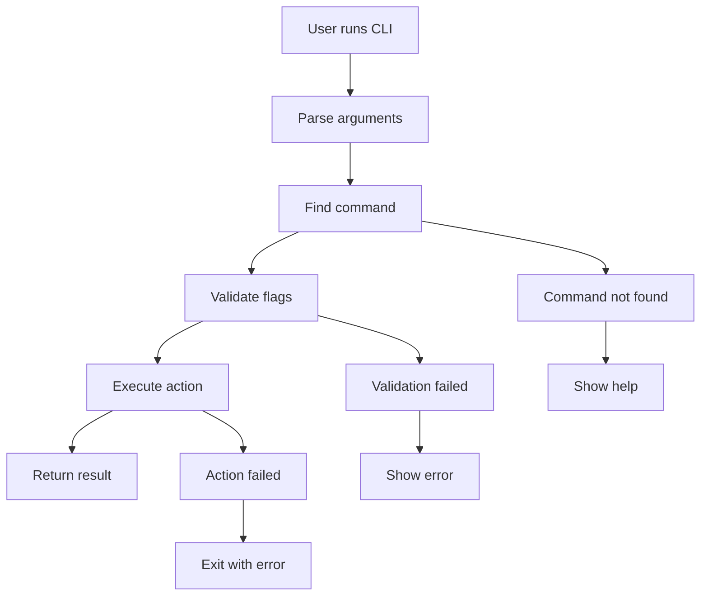

# 🏗️ Lumos Architecture & Design

Understanding the internal structure and design decisions of Lumos CLI framework.

## 📋 Table of Contents

- [Core Philosophy](#core-philosophy)
- [Module Architecture](#module-architecture)
- [Command Flow](#command-flow)
- [Design Patterns](#design-patterns)
- [Extension Points](#extension-points)
- [Performance Considerations](#performance-considerations)

## 🎯 Core Philosophy

Lumos is built around these core principles:

### 1. **Simplicity First**
- Minimal API surface that's easy to learn
- Sensible defaults that work out of the box
- Clear separation of concerns

### 2. **Composability**
- Small, focused modules that work together
- Fluent API that encourages method chaining
- Pluggable components for customization

### 3. **Developer Experience**
- Rich error messages with helpful suggestions
- Comprehensive documentation and examples
- Fast feedback loops during development

### 4. **Production Ready**
- Robust error handling and validation
- Performance optimized for CLI use cases
- Extensive test coverage

## 🏛️ Module Architecture

Lumos follows a layered architecture:

```
┌─────────────────────────────────────┐
│           User Application          │
├─────────────────────────────────────┤
│              CLI App                │
│          (lumos.app)                │
├─────────────────────────────────────┤
│        Core Framework              │
│     (lumos.core, lumos.flags)     │
├─────────────────────────────────────┤
│         UI Components              │
│ (color, progress, prompt, table)   │
├─────────────────────────────────────┤
│        Utility Modules             │
│   (json, config, format, loader)   │
└─────────────────────────────────────┘
```

### Core Modules

#### `lumos.init`
- **Purpose**: Main entry point and public API
- **Responsibilities**: Module exports and version management
- **Dependencies**: All other modules

#### `lumos.app`
- **Purpose**: Application and command builder
- **Responsibilities**: Command definitions, fluent API
- **Key Classes**: `Command`, application instance
- **Dependencies**: `lumos.core`

#### `lumos.core`
- **Purpose**: Argument parsing and execution logic
- **Responsibilities**: CLI parsing, command resolution, execution flow
- **Dependencies**: `lumos.flags`

#### `lumos.flags`
- **Purpose**: Flag parsing and validation
- **Responsibilities**: Type validation, constraint checking
- **Dependencies**: None (base module)

### UI Component Modules

#### `lumos.color`
- **Purpose**: Terminal color and styling
- **Features**: ANSI color codes, auto-detection, template formatting
- **Dependencies**: `lumos.format`

#### `lumos.progress`
- **Purpose**: Progress bars and loading indicators
- **Features**: Customizable progress bars, percentage display
- **Dependencies**: None

#### `lumos.prompt`
- **Purpose**: Interactive user input
- **Features**: Text input, confirmations, selections, validation
- **Dependencies**: None

#### `lumos.table`
- **Purpose**: Tabular data formatting
- **Features**: Bordered tables, alignment, key-value displays
- **Dependencies**: None

### Utility Modules

#### `lumos.json`
- **Purpose**: JSON encoding and decoding
- **Features**: Pure Lua JSON implementation
- **Dependencies**: None

#### `lumos.config`
- **Purpose**: Configuration file management
- **Features**: File loading, environment variables, merging
- **Dependencies**: `lumos.json`

#### `lumos.format`
- **Purpose**: Text formatting and manipulation
- **Features**: ANSI formatting, text wrapping, case conversion
- **Dependencies**: None

## 🔄 Command Flow

The execution flow in a Lumos application follows this pattern:



### Detailed Flow

1. **Initialization**
   ```lua
   local app = lumos.new_app(config)
   ```
   - Creates application instance
   - Sets up default configuration

2. **Command Definition**
   ```lua
   local cmd = app:command(name, description)
   cmd:arg(...):flag(...):action(...)
   ```
   - Builds command tree
   - Defines flags and arguments
   - Sets action handlers

3. **Argument Parsing**
   ```lua
   app:run(arg)
   ```
   - Parses command line arguments
   - Resolves commands and subcommands
   - Validates flag types and constraints

4. **Execution**
   - Calls appropriate action function
   - Passes context object with args and flags
   - Handles return values for success/failure

## 🎨 Design Patterns

### Fluent Interface (Builder Pattern)

Commands use method chaining for readable configuration:

```lua
local deploy = app:command("deploy", "Deploy application")
    :arg("environment", "Target environment")
    :flag("-f --force", "Force deployment")
    :flag_int("--timeout", "Timeout in seconds", 1, 3600)
    :action(function(ctx) ... end)
```

**Benefits**:
- Highly readable and intuitive
- Self-documenting code
- IDE-friendly with autocomplete

### Command Pattern

Each command encapsulates its behavior:

```lua
{
    name = "deploy",
    description = "Deploy application",
    args = {...},
    flags = {...},
    action = function(ctx) ... end
}
```

**Benefits**:
- Clear separation of concerns
- Easy to test individual commands
- Supports command composition

### Template Method Pattern

UI components use consistent interfaces:

```lua
-- All UI components follow similar patterns
color.red(text)
progress.simple(current, total)
prompt.input(message, default)
table.simple(data, options)
```

**Benefits**:
- Consistent API across components
- Easy to learn and remember
- Predictable behavior

## 🔌 Extension Points

Lumos provides several ways to extend functionality:

### Custom Validators

Add new flag types with custom validation:

```lua
-- In lumos.flags module
validators.custom_type = function(value)
    -- Your validation logic
    return is_valid, error_message
end
```

### UI Components

Create new UI components following the established patterns:

```lua
local my_component = {}

function my_component.display(data, options)
    -- Your display logic
end

return my_component
```

### Configuration Loaders

Extend configuration loading:

```lua
-- In lumos.config module
function config.load_custom_format(file_path)
    -- Your custom format loader
end
```

### Command Hooks

Add pre/post execution hooks:

```lua
-- Future extension point
cmd:before_action(function(ctx) ... end)
cmd:after_action(function(ctx, result) ... end)
```

## ⚡ Performance Considerations

### Lazy Loading

Modules are loaded on-demand to minimize startup time:

```lua
-- Only load heavy modules when needed
local function get_json()
    return require('lumos.json')
end
```

### Memory Management

- Reuse objects where possible
- Avoid creating unnecessary temporary strings
- Clean up resources in long-running operations

### Startup Time

- Minimal module initialization
- Defer expensive operations until needed
- Cache computed values when appropriate

### Best Practices

1. **Module Design**
   - Keep modules focused and small
   - Minimize dependencies between modules
   - Use clear, consistent interfaces

2. **Error Handling**
   - Provide helpful error messages
   - Include suggestions for fixing issues
   - Fail fast with clear diagnostics

3. **Testing**
   - Unit test each module independently
   - Integration test command flows
   - Test error conditions thoroughly

4. **Documentation**
   - Document public APIs comprehensively
   - Include examples for complex features
   - Keep documentation up-to-date with code

## 🔮 Future Architecture Considerations

### Plugin System

A future plugin system might include:

```lua
-- Plugin registration
lumos.register_plugin('my-plugin', {
    commands = {...},
    ui_components = {...},
    validators = {...}
})
```

### Configuration Schema

Structured configuration with validation:

```lua
-- Schema-based config validation
local schema = {
    timeout = {type = 'integer', min = 1},
    host = {type = 'string', required = true},
    features = {type = 'array', items = {type = 'string'}}
}
```

### Async Operations

Support for asynchronous operations:

```lua
-- Future async support
cmd:async_action(function(ctx)
    return coroutine.create(function()
        -- Async work
    end)
end)
```

This architecture provides a solid foundation for building powerful CLI applications while maintaining simplicity and extensibility.
